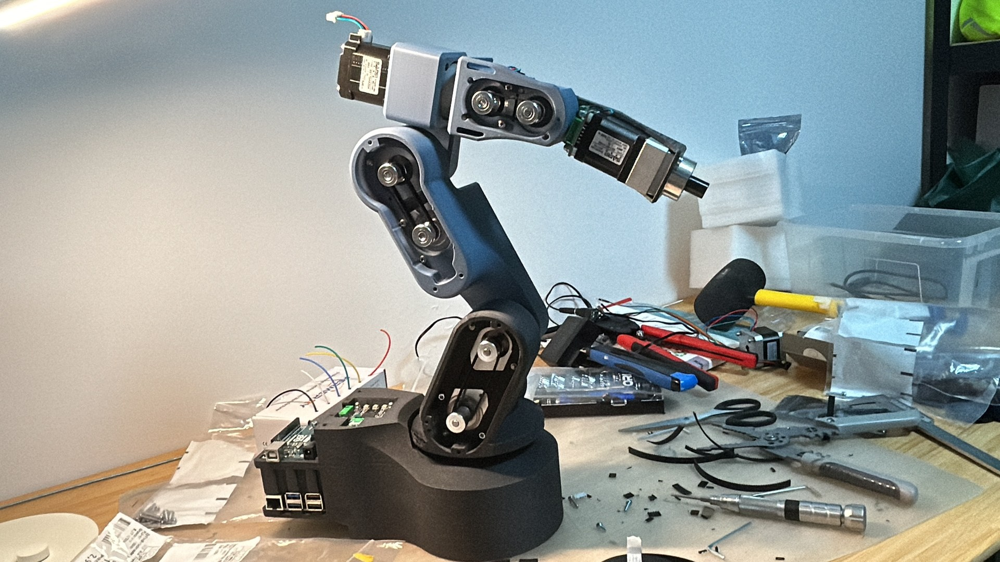
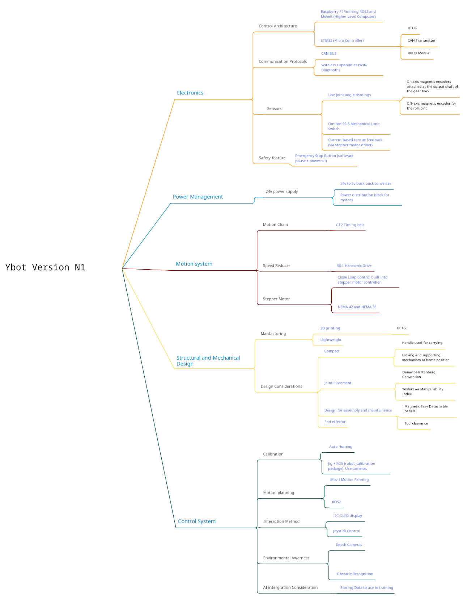

# YBot N1: Project Plan and Tech Stack

> **N1 is the project plan I laid out from the start of YBot**, my open-source 6-DOF robotic arm. The arm was designed according to this plan. This page breaks down its system design and tech stack.
>
> **Status: incomplete.** The arm is designed and built, but the software and coding side is unfinished.
>
> Full project write-up (design iterations, build, lessons learned, status): `YBot_6DOF_Robot_Arm.docx`

| At a glance | |
|---|---|
| Compute | Raspberry Pi 5 running ROS 2 + MoveIt · STM32 microcontroller running an RTOS |
| Communication | CAN bus · Wi-Fi / Bluetooth |
| Actuation | Closed-loop NEMA 17 / NEMA 14 steppers · 50:1 harmonic drives · GT2 timing belts |
| Sensing | Magnetic joint encoders · Omron SS-5 limit switches · current-based torque feedback |
| Power | 24 V supply · 24 V → 5 V buck converter |
| Structure | 3D-printed PETG |
| Estimated BOM cost | S$610.55 per unit |

---

## 1. Electronics

### Control architecture

| Layer | Hardware | Role |
|---|---|---|
| High-level computer | Raspberry Pi 5 | Runs ROS 2 and MoveIt |
| Microcontroller | STM32 | Runs an RTOS; handles the CAN transmitter and RX/TX module |

### Communication protocols

- **CAN bus** between the controller and the joints
- **Wireless**: Wi-Fi / Bluetooth

### Sensors

- **Live joint angle readings**
  - On-axis magnetic encoders attached to the output shaft of each gearbox
  - Off-axis magnetic encoder for the roll joint
- **Omron SS-5 mechanical limit switches**
- **Current-based torque feedback**, read through the stepper motor drivers

### Safety

- Emergency stop button: software pause plus hardware power cut

---

## 2. Power Management

- 24 V power supply
- 24 V → 5 V buck converter for the logic side
- Power distribution block for the motors

---

## 3. Motion System

| Stage | Component |
|---|---|
| Motor | NEMA 17 and NEMA 14 stepper motors (42 mm / 35 mm frames) |
| Driver | MakerBase Servo 42C / 35C, with closed-loop control built into the driver |
| Speed reducer | 50:1 harmonic drive |
| Motion chain | GT2 timing belt |

---

## 4. Structural and Mechanical Design

### Manufacturing

- 3D printed in **PETG**
- Designed to be lightweight

### Design considerations

- **Compact**
  - Handle for carrying
  - Locking and supporting mechanism at the home position
- **Joint placement**
  - Denavit–Hartenberg convention
  - Yoshikawa manipulability index
- **Design for assembly and maintenance**
  - Magnetic, easily detachable panels
- **End effector**
  - Tool clearance

---

## 5. Control System

| Area | Approach |
|---|---|
| Calibration | Auto homing · jig + ROS `robot_calibration` package using cameras |
| Motion planning | MoveIt on ROS 2 |
| Interaction | I²C OLED display · joystick control |
| Environmental awareness | Depth cameras · obstacle recognition |
| AI integration | Storing data for use in training |

---

## 6. Bill of Materials

| Component | Qty | Unit (S$) | Total (S$) |
|---|--:|--:|--:|
| Sanser NEMA 17 stepper motor (0.38 N·m) | 2 | 22.50 | 45.00 |
| Sanser NEMA 17 stepper motor (0.54 N·m) | 2 | 27.90 | 55.80 |
| Sanser NEMA 14 stepper motor (0.14 N·m) | 2 | 27.90 | 55.80 |
| MakerBase Servo 42C stepper motor driver | 4 | 7.56 | 30.23 |
| MakerBase Servo 35C stepper motor driver | 2 | 8.28 | 16.56 |
| Harmonic drive speed reducer, NEMA 17 (11-30) | 4 | 45.36 | 181.44 |
| Harmonic drive speed reducer, NEMA 14 (11-30) | 2 | 52.56 | 105.12 |
| Raspberry Pi 5 | 1 | 59.40 | 59.40 |
| STM32 dev board | 1 | 18.00 | 18.00 |
| 24 V DC power supply | 1 | 6.84 | 6.84 |
| DC-DC voltage step-down | 1 | 6.12 | 6.12 |
| 3D-printed parts (filament) | 1.2 kg | 25.20 / kg | 30.24 |
| **Total** | | | **610.55** |

Excludes labour and electricity. Prices converted from CNY and rounded.

---

## Project Status

YBot is an incomplete project. In 2025 I was busy with my college entrance exams, so I didn't have time to continue with the software and coding. Now that I'm at university in the RMI course, I'm properly learning coding and ROS 2, so perhaps this will be a project that I revisit soon

---

**Source:** [Project mind map (Google Drive)](https://drive.google.com/file/d/1FfaCFyQd3SJTOoaxjn64O45hB4HM383M/view?usp=sharing)
